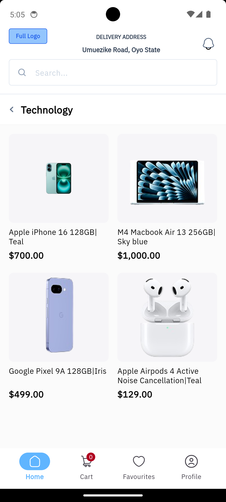
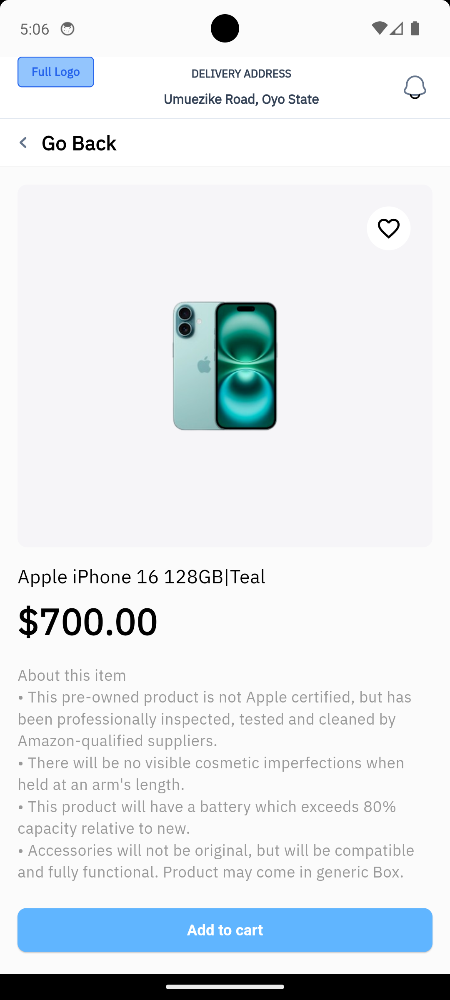
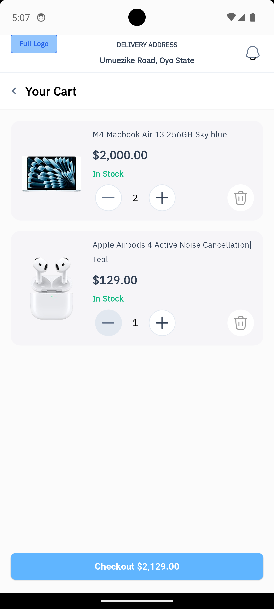

# 🛍️ Flutter E-Commerce App

A scalable and modular **Flutter E-Commerce application** built as part of a job assessment. The app demonstrates a clean architecture approach with separate layers for data, domain, and presentation. It supports product browsing and full cart functionality with clean and testable code.

---

## 🧱 Tech Stack

| Layer         | Technology / Library                |
|--------------|--------------------------------------|
| Language      | Dart                                |
| Framework     | Flutter                             |
| Architecture  | Clean Architecture                  |
| State Mgmt    | Provider                            |
| Routing       | Flutter PageRouter             |
| Offline Cache | Local Datasources (Simulated)       |
| UI            | Flutter Widgets, Custom Components  |

---

## 🚀 Getting Started

### Prerequisites

- [Flutter SDK](https://docs.flutter.dev/get-started/install)
- Dart >= 3.x
- A connected device or emulator

### 🛠 Installation & Run

1. **Clone the repository**
   ```bash
   git clone https://github.com/pelDev/alphatwelve-assessment.git
   cd alphatwelve-assessment
   ```

2. **Install dependencies**
   ```bash
   flutter pub get
   ```

3. **Run the application**
   ```bash
   flutter run
   ```

---

## 📸 Screenshots

> Make sure to place your screenshots in the `/screenshots/` folder and update the paths if needed.

| Product List | Product Detail | Cart |
|--------------|----------------|------|
|  |  |  |

---

## 🗂️ Project Structure

```
├── main.dart                 # Entry point
│
├── core/
│   ├── constants/            # Re-usable values
│   ├── icons/                # Custom icons
│   ├── network/              # Network helpers
│   ├── theme/                # Colors and themes
│   ├── utils/                # Formatters, helpers
│   └── widgets/              # Shared widgets
│
├── root/
│   ├── presentation/         # Navigation shell
│   └── widgets/              # App bar, navigation bar
│
├── features/
│   ├── product/
│   │   ├── data/             # Datasources, models
│   │   ├── domain/           # Entities, use cases
│   │   └── presentation/     # Screens, widgets, providers
│   └── cart/
│       ├── data/
│       ├── domain/
│       └── presentation/
```

---

## ✨ Features

- 🛍️ Product listing with images and pricing
- 🔍 Product detail screen
- 🛒 Add, update, and remove cart items
- 🧭 Custom animated navigation
- 💅 Reusable custom widgets and theming

---

## ✅ What's Covered

- Clean architecture separation (data/domain/presentation)
- Local data sources
- Provider for state management
- Reusable components and utilities
- Folder-by-feature modularity

---

## 🧪 Potential Enhancements

- Unit and widget testing
- Remote API integration
- Persistent storage (Hive, SharedPreferences)
- CI/CD pipelines
- User authentication